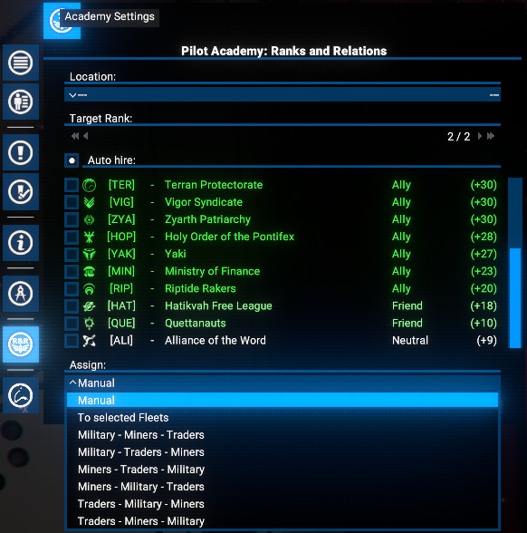
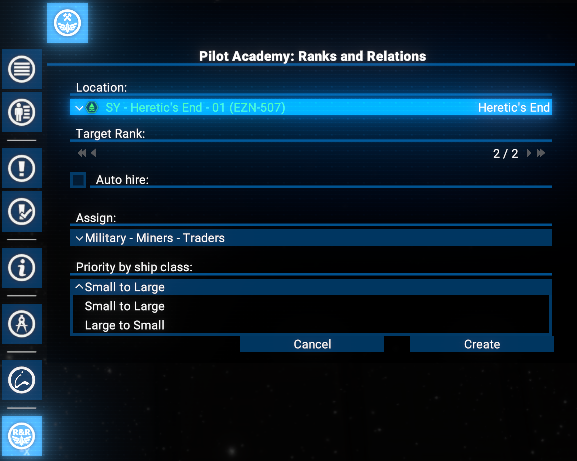
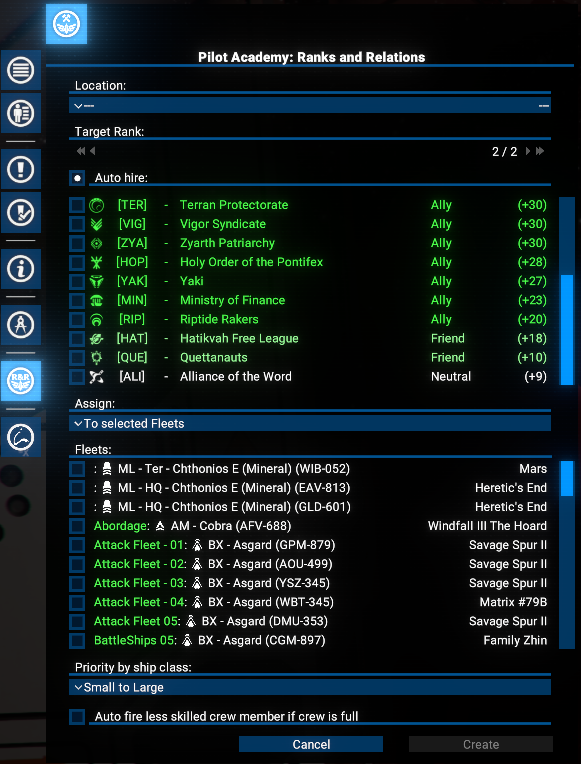
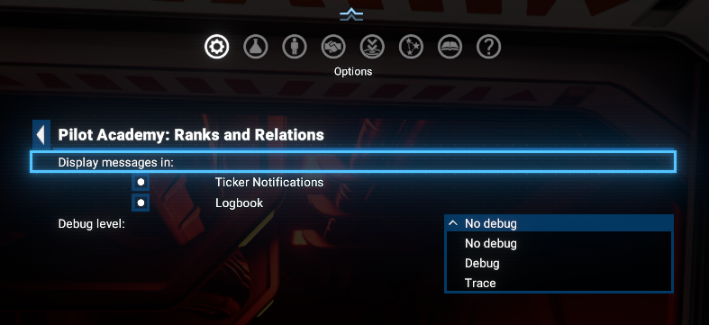
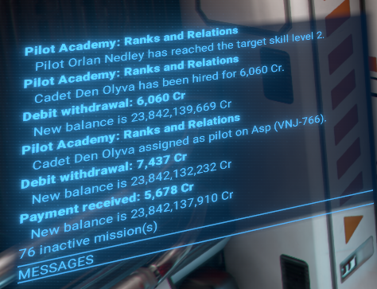
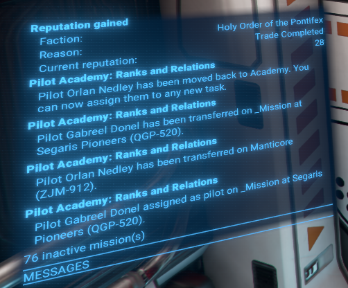
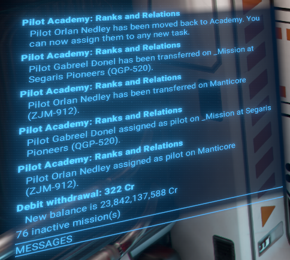
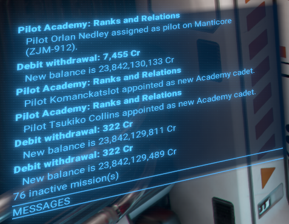

# Pilot Academy: Ranks and Relations

This mod introduces the Pilot Academy, allowing the Player to train pilots through simple trading while simultaneously improving relations with factions.

## Features

- **Intuitive UI**: Easily manage all Academy operations.
- **Pilot Training**: Train pilots effectively using trade operations.
- **Faction Relations**: Improve the Player's standing with other factions through trade.
- **Wing Organization**: Organize the Player's trainees into Wings for efficient management.
- **Goal Selection**: Prioritize either pilot training or improving relations.
- **Faction Limiting**: Restrict training and relation-building activities to specific factions for each Wing.
- **Researchable Upgrades**:
  - Expand to 9 Wings.
  - Train pilots up to the 5-star rank.
  - Automatically hire `Cadets` from selected factions.
  - Automatically assign `Trained Pilots` to the Player's ships based on priority.

## Limitations

- The Academy currently only supports small (S-class) ships.
- Trades used for the training process are non-profitable and uses only one item of selected ware per transaction.

## Requirements

- **X4: Foundations**: Version 8.00HF3 or newer.
- **UI Extensions and HUD**: Version v8.0.4.0 or higher by [kuertee](https://next.nexusmods.com/profile/kuertee?gameId=2659).
  - Available on Nexus Mods: [UI Extensions and HUD](https://www.nexusmods.com/x4foundations/mods/552)
- **Mod Support APIs**: Version 1.95 or higher by [SirNukes](https://next.nexusmods.com/profile/sirnukes?gameId=2659).
  - Available on Steam: [SirNukes Mod Support APIs](https://steamcommunity.com/sharedfiles/filedetails/?id=2042901274)
  - Available on Nexus Mods: [Mod Support APIs](https://www.nexusmods.com/x4foundations/mods/503)

## Caution

This is a complex mod and may have undiscovered issues. Please report any problems on the Nexus Mods or Steam Workshop pages.

## Installation

- **Steam Workshop**: [Pilot Academy: Ranks and Relations](https://steamcommunity.com/sharedfiles/filedetails/?id=3663606124)
- **Nexus Mods**: [Pilot Academy: Ranks and Relations](https://www.nexusmods.com/x4foundations/mods/1972)

## Training Procedure

- After the `Academy`'s location is set, the Player can create the first `Wing`.
- Once a `Wing` is created, any number of `Wingmen` can be added to it.
- Immediately after `Wing` creation, a special order will search for the best trade deal to increase rank and relations.
- After each sale, the ship pilot's current rank will be checked against the target level.
- If the rank is reached, the presence of `Cadets` at the `Academy` station will be checked, and the first available candidate will be transferred to the ship.
- If no `Cadets` are detected, the `Auto Hire` option will be checked. If enabled, a new `Cadet` will be hired for the ship, and the appropriate fee will be paid.
- If no `Cadets` are available and `Auto Hire` is disabled, the script will repeat these checks in 3 minutes.
- Otherwise, the `Trained Pilot` on the ship will be swapped with a `Cadet` and then moved to the `Academy` station.
- If the `Assign` option is not set to `Manual`, and the last assignment turn was finished at least 2 minutes ago, the `Auto Assign` procedure will be initiated.
- Based on the `Assign` setting, a ship with a pilot who has a lower rank (and is below the target rank level) will be selected.
- Please take in account: if crew is full, by default you will get a warning notification and the pilot swapping will not be performed. But if the option `Auto fire less skilled crew member if crew is full` is enabled, the less qualified crew member will be automatically dismissed to free up space for the new pilot transfer.
- If such a ship is found, the `Trained Pilot` will be assigned as its pilot, and the existing pilot will be transferred to the `Academy` station as a new `Cadet`.
- Every 3 minutes, the `Auto Assign` procedure will repeat to check for available `Trained Pilots`.

## Usage

After installation, a new icon will appear on the left menu panel. Clicking it opens the `Academy` management window.

The `Academy` window has three types of tabs:

- `Academy Settings`
- `Cadets and Pilots`
- Wings management tabs, including `Add New Wing`

### Academy Settings

The `Academy Settings` tab includes controls for location, target skill level, auto-hiring, and auto-assigning `Trained Pilots`.

#### Academy Location

The `Academy` uses an assigned Player-owned or other faction's station as living quarters for `Cadets` and `Trained Pilots`.

In the early game, when the Player may not own any stations, other factions' wharfs, shipyards, or trading stations can be used, depending on the Player's reputation with them.

Any available station can be chosen.

If a non-Player-owned station is selected, the Player will be charged a daily rental fee.

If the Player owns any stations, other factions' stations will not appear in the location list.

Any Player-owned station can be selected, though using the HQ is not recommended to avoid interference with terraforming projects.

##### Resetting the Academy Location

At any time, the Player can reset the `Academy` location by pressing the button with the current station info. A new station can then be selected from the dropdown.
After pressing the `Update` button, the location will be changed, and `Cadets` and `Trained Pilots` will be moved to the new `Academy` station.

#### Auto Hire Cadets

After completing the appropriate research, the Player can enable the auto-hire feature.

This will automatically hire new `Cadets` from the selected factions, and the Player will be charged the standard hiring fees.

#### Auto Assign Trained Pilots

Once researched, the Player can enable auto-assign in the `Academy` interface. This allows the Player to set priorities for assigning pilots who have reached the target rank, based on ship role and size.

When auto-assign is active, `Trained Pilots` will replace existing pilots on the Player's ships who have a lower rank than the target. The replaced pilots will be reassigned to the `Academy` as `Cadets`.

Pilot will be assigned based on the selected priority:

- `By ship purpose`: The Player can prioritize ships based on their role, such as combat, trading, mining, or by presence in selected fleets.
  

- `By ship size`: The Player can prioritize ships based on their size, from small to large or vice versa.
  

In case of selecting the `To Selected Fleets` option, the Player can select specific fleets for pilot assignment. Only ships that are part of the selected fleets will be considered for auto-assignment.

In addition, please be aware about situation when the target ship's crew is full. By default, in this case, the pilot swapping will not be performed and the Player will get a warning notification.

But if the option `Auto fire less skilled crew member if crew is full` is enabled, the less qualified crew member will be automatically dismissed to free up space for the new pilot transfer.

### Cadets and Pilots

This tab displays a list of the Player's `Cadets` and `Trained Pilots`. Initially, both lists will be empty.

#### Hiring Cadets

The Player can manually hire `Cadets` in two ways:

- From the global Personnel Management screen.

  

- From the crew tab of the Player's existing ships.

  

Use the `Appoint as cadet` option in the context menu.

It will take some time to transfer `Cadets` from their original location, and they will be grayed out while in transit.

The Player can also use the context menu to manage them like any other employee.

#### Managing Trained Pilots

If auto-assign is not used, `Trained Pilots` will return to the `Academy`.

The Player can then manage them in the same way as `Cadets`.

### Wings

All training functionality of the `Academy` is based on `Wings`. Each `Wing` can contain any number of `Wingmen`. The Player must select one ship as a `Wing Leader` and then add any number of direct subordinates with the `Mimic` directive.

Initially, the Player can manage 3 Wings. To increase the number of available Wings, the Player must complete the appropriate research.

To start, open the `Add New Wing` tab.

#### Add New Wing

##### Primary Goal

First, the Player must select a `Primary Goal` for the `Wing`:

- `Increase Rank`: Work with any faction to complete as many trade runs as possible in a given time.
- `Gain Reputation`: Focus on deals with specific factions to increase reputation with them.

##### Trade Data Refresh Interval

Since the market situation is not static, the `Wing Commander` must re-check market data to be most effective. The Player can set a value from 5 minutes to one hour.

##### Wing Leader Selection

The main part of `Wing` creation is selecting the `Wing Leader`. Use the appropriate dropdown, which will display all unassigned S-class ships, sorted by their pilots' ranks.

##### Create the Wing

Simply press the `Create` button to finalize the `Wing` creation process.

#### Wing Management Tab

Immediately after `Wing` creation, the current tab focus will switch to the newly created `Wing`. The first one will be `Alpha`.

##### Add Wingmen

The Player can add any number of `Wingmen` to an existing `Wing` at any time on the appropriate `Wing...` tab using the `Add Wingman` dropdown.

Note: It takes several seconds for an added `Wingman` to appear in the `Wingmen` list after selection.

### Fleets, Wing Leader and Wingman Context Menus, Hotkey and Mouse Double-click

The Player can use the standard `I` key (or another, depending on key binding settings) to open the `Information` window if a `Fleet`, `Wing Leader` or `Wingman` item is selected.

The same action is available via the `Context Menu`.

For a `Wingman`, the `Remove Assignment` action is also available.

In addition, please be aware:

- If a `Fleet`, `Wing Leader` or `Wingman` item is selected (by one or two mouse clicks), it will be selected as a map object too.
- Double-clicking on a `Fleet`, `Wing Leader` or `Wingman` item will shift a map focus to the corresponding ship.

### Research

The previously mentioned researchable upgrades are available in the standard `Research` interface under the `Pilot Academy RnR` group:

- `Pilot Academy. Five wings`: Extends the `Academy` capacity to support five wings.
- `Pilot Academy. Nine wings`: Extends the `Academy` capacity to support nine wings.
- `Pilot Academy. 3-star pilots`: Allows training of 3-star pilots in the Academy.
- `Pilot Academy. 4-star pilots`: Allows training of 4-star pilots in the Academy.
- `Pilot Academy. 5-star pilots`: Allows training of 5-star pilots in the Academy.
- `Pilot Academy. Auto hire`: Adds the ability to automate `Cadet` hiring from desired factions.
- `Pilot Academy. Auto assign`: Adds the ability to automate pilot assignment to ships outside the Academy.

### Options

An options menu is available via the `Extension Options` menu.

Player can:

- Enable / disable the notifications in the `Notification Ticker` and `Logbook`.
- Set the  debug level for the mod. By default, it is set to `No debug`.

### Notifications and Logbook messages

Several notifications are implemented to keep the Player informed about important events related to `Academy` operations. They will be shown in the standard notifications area (ticker) and in the `Logbook`, if appropriate settings are enabled.

There are examples of texts and notifications screenshots:

- When a pilot has finished training and reached the target rank: "Pilot %s has reached the target skill level %s."

  

- When no free `Cadets` are available at the academy to replace a trained pilot: "No free cadets available for pilots swapping!"

  

- If a new `Cadet` is hired: "Cadet %s has been hired for %s {1001,101}."

  

- If there is no free space on a ship to transfer a `Cadet`: "No free crew capacity on %s to do pilot swapping!"

- When a new `Cadet` is assigned to a Wing: "Cadet %s assigned as pilot on %s."

  

- When a `Trained Pilot` is moved back to the academy: "Pilot %s has been moved back to Academy. You can now assign them to any new task."

  

- With `Auto Assign`, when a `Trained Pilot` arrives on a new ship: "Pilot %s has been transferred on %s."

  

- An then on pilots swapping: "Pilot %s assigned as pilot on %s."

  

- After moving the "old" one to the `Academy`, the Player will be notified with: "Pilot %s appointed as new Academy cadet."

  

- In case of errors in `Cadet` and `Trained Pilot` transfers and swaps, several warning messages will be displayed:

  - "Can't perform pilot swapping on %s! Please do it manually!"
  - "Can't return pilot %s to the Academy! Please do it manually!"
  - "No free capacity at Academy to return pilot %s! Please resolve it!"
  - "Can't move new pilot %s to %s!"

- And hopefully, this warning will not be displayed: "Can't assign Academy training order on wing %s with leader ship %s! Please report the issue!"

## Credits

- **Author**: Chem O`Dun, on [Nexus Mods](https://next.nexusmods.com/profile/ChemODun/mods?gameId=2659) and [Steam Workshop](https://steamcommunity.com/id/chemodun/myworkshopfiles/?appid=392160)
- *"X4: Foundations"* is a trademark of [Egosoft](https://www.egosoft.com).

## Acknowledgements

- [EGOSOFT](https://www.egosoft.com) — for the X series.
- [kuertee](https://next.nexusmods.com/profile/kuertee?gameId=2659) — for the `UI Extensions and HUD` that makes this extension possible.
- [SirNukes](https://next.nexusmods.com/profile/sirnukes?gameId=2659) — for the `Mod Support APIs` that power the UI hooks.

## Changelog

### [1.05] - 2026-02-20

- **Added**
  - The `To Selected Fleets` assignment option now allows you to manually transfer any of your skilled pilots to the `Academy`. The Academy can then act as a **Pilot Dispatch center**, automatically assigning these experienced pilots to fill open roles in your selected fleets.

- **Fixed**
  - `Academy` tabs titles
  - Managing `Cadets` and `Trained Pilots` when Academy is situated on non-Player station
  - Selection of some UI items
  - Increased reachability check accuracy for trade offers evaluation

### [1.04] - 2026-02-15

- **Added**
  - New target selection for `Trained Pilots` assignment: `To Selected Fleets`. With this option, the Player can select a specific fleets for the pilot assignment.
- **Fixed**
  - Factions and Wingmans scrolling in the Academy window
  - Wing Leander an Wingmans selections
  - Title for pilot moving notifications
  - Other small visual issues in the Academy window

### [1.03] - 2026-02-14

- **Added**
  - New option `Auto fire less skilled crew member if crew is full` to automatically dismiss the less qualified crew member if the target ship's crew is full during pilot swapping.
- **Improved**
  - Academy window drawing preparation

### [1.02] - 2026-02-12

- **Fixed**
  - Some small code mistypings
- **Improved**
  - Some code optimization and refactoring

### [1.01] - 2026-02-12

- **Fixed**
  - Academy window not displayed properly on resolutions higher than Full HD (1920x1080)

### [1.00] - 2026-02-10

- **Added**
  - Initial public version
