# Pilot Academy: Ranks and Relations

This mod introduces the Pilot Academy, allowing you to train pilots and improve faction relations through trade operations.

## Features

- **Intuitive UI**: Easily manage all Academy operations.
- **Pilot Training**: Train pilots effectively using trade operations.
- **Faction Relations**: Improve your standing with other factions through trade.
- **Wing Organization**: Organize your trainees into wings for efficient management.
- **Goal Selection**: Prioritize either pilot training or improving relations.
- **Faction Limiting**: Restrict training and relation-building activities to specific factions for each wing.
- **Remote Academy**: Host your Academy on a non-player-owned station for a rental fee.
- **Researchable Upgrades**:
  - Expand to 9 wings.
  - Train pilots up to the 5-star rank.
  - Automatically hire cadets from selected factions.
  - Automatically assign trained pilots to your ships based on priority.

## Limitations

- The Academy currently only supports small (S-class) ships.

## Requirements

- **X4: Foundations**: Version 8.00HF3 or newer.
- **UI Extensions and HUD**: Version 8.036 or higher by [kuertee](https://next.nexusmods.com/profile/kuertee?gameId=2659).
  - Available on Nexus Mods: [UI Extensions and HUD](https://www.nexusmods.com/x4foundations/mods/552)
- **Mod Support APIs**: Version 1.93 or higher by [SirNukes](https://next.nexusmods.com/profile/sirnukes?gameId=2659).
  - Available on Steam: [SirNukes Mod Support APIs](https://steamcommunity.com/sharedfiles/filedetails/?id=2042901274)
  - Available on Nexus Mods: [Mod Support APIs](https://www.nexusmods.com/x4foundations/mods/503)

## Caution

This is a complex mod and may have undiscovered issues. Please report any problems on the Nexus Mods or Steam Workshop pages.

## Installation

- **Steam Workshop**: [Pilot Academy: Ranks and Relations](https://steamcommunity.com/sharedfiles/filedetails/?id=)
- **Nexus Mods**: [Pilot Academy: Ranks and Relations](https://www.nexusmods.com/x4foundations/mods/)

## Usage

After installation, a new icon will appear on the left menu panel. Clicking it opens the Academy settings window.

### Academy Settings

The Academy settings window includes controls for location, target skill level, auto-hiring, and auto-assigning pilots.

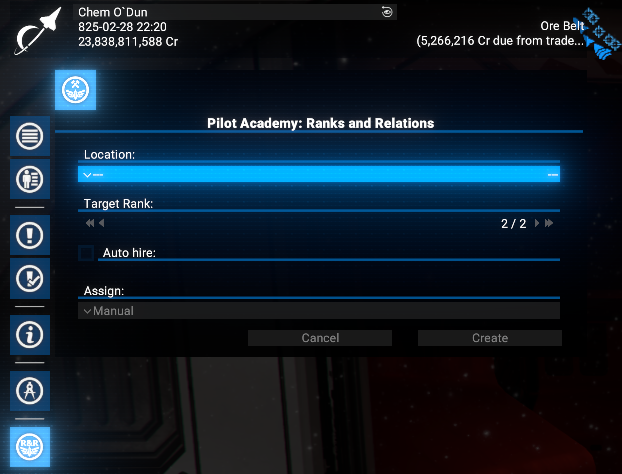

#### Academy Location

The Academy must be assigned to a player-owned or other faction's station to serve as living quarters for cadets and pilots.

In the early game, when you may not own a station, you can use other factions' wharfs, shipyards, or trading stations, depending on your reputation with them.

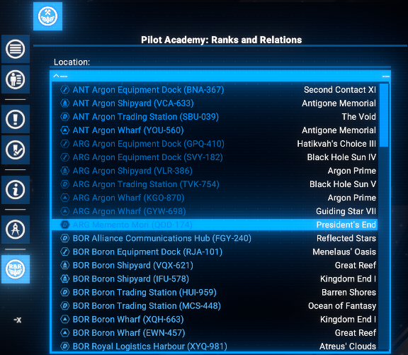

You can choose any available station.

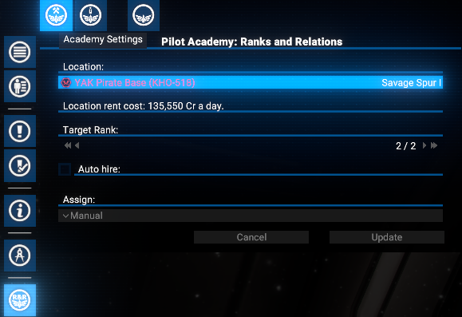

If you use another faction's station, you will be charged a daily rental fee.

If you own any stations, other factions' stations will not appear in the location list.

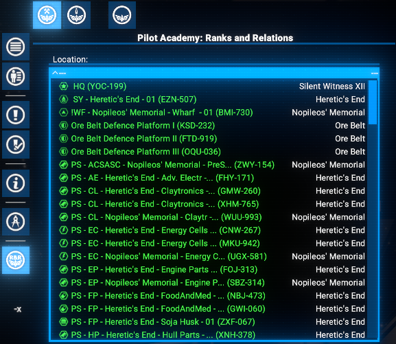

You can select any of your own stations, though using the HQ is not recommended to avoid interference with terraforming projects.

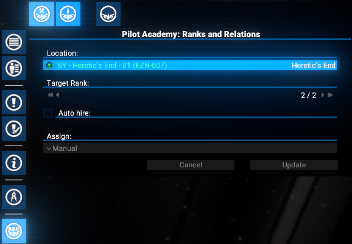

#### Auto-Hire

After completing the appropriate research, you can enable the auto-hire feature.

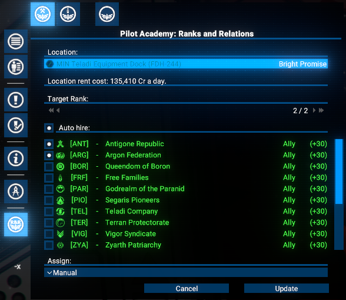

This will automatically hire new cadets from the selected factions, and you will be charged the standard hiring fees.

#### Auto-Assign

Once researched, you can enable auto-assign in the Academy interface. This allows you to set priorities for assigning pilots who have reached the target rank, based on ship role and size.

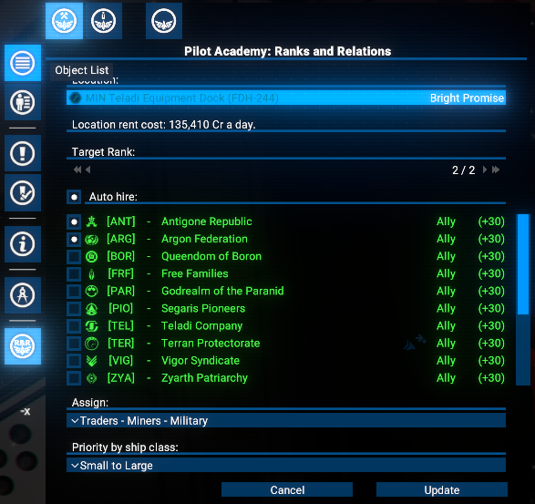

When auto-assign is active, trained pilots will replace existing pilots on your ships who have a lower rank than the target. The replaced pilots will be reassigned to the Academy as cadets.

### Personnel Management

This window displays a list of your cadets and trained pilots. Initially, both lists will be empty.

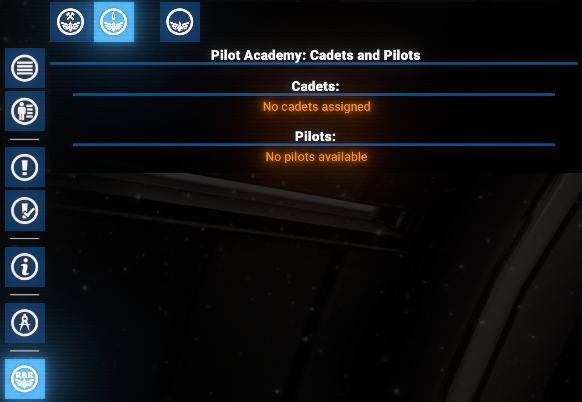

#### Hiring Cadets

You can manually hire cadets in two ways:
- From the Personnel Management screen.

  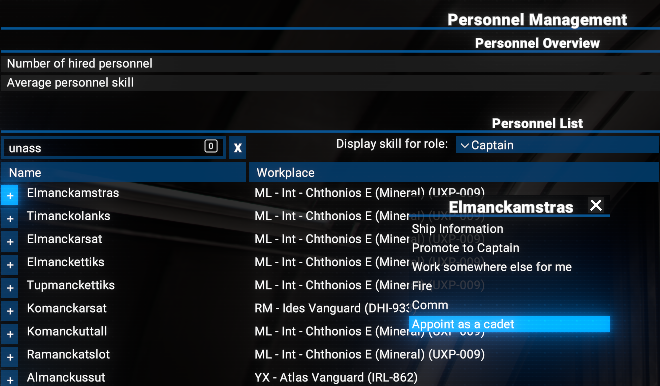

- From the crew panel of your existing ships.

  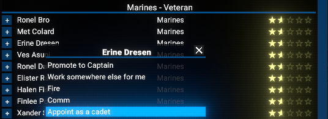

Use the "Appoint as cadet" option in the context menu.

Cadets will take some time to transfer from their original location and will be grayed out while in transit.

You can also use the context menu to manage them like any other employee.

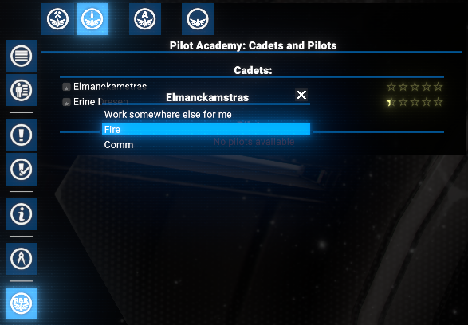

#### Managing Trained Pilots

If auto-assign is not used, trained pilots will return to the Academy.

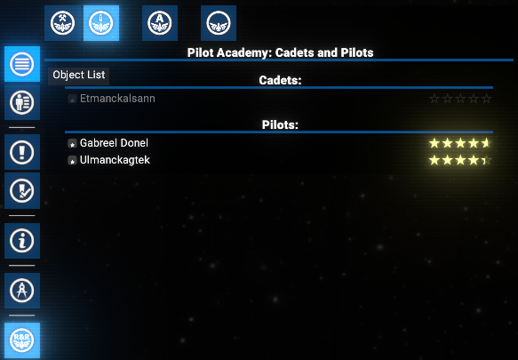

You can then manage them in the same way as cadets.

### Wings

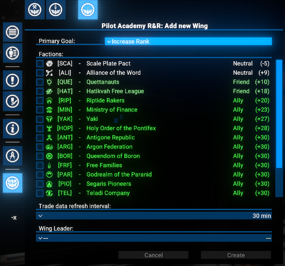
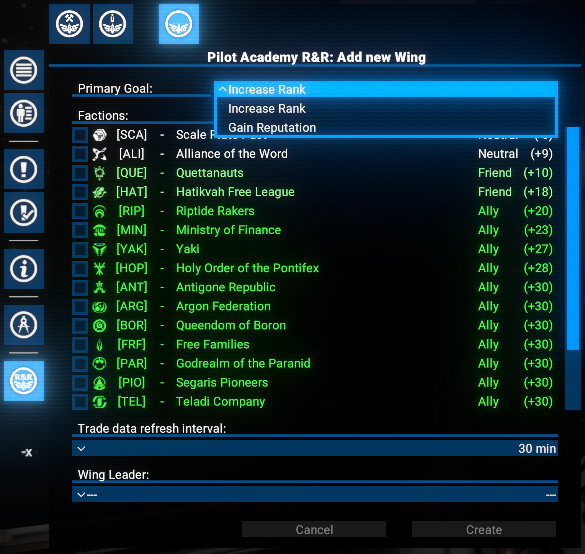
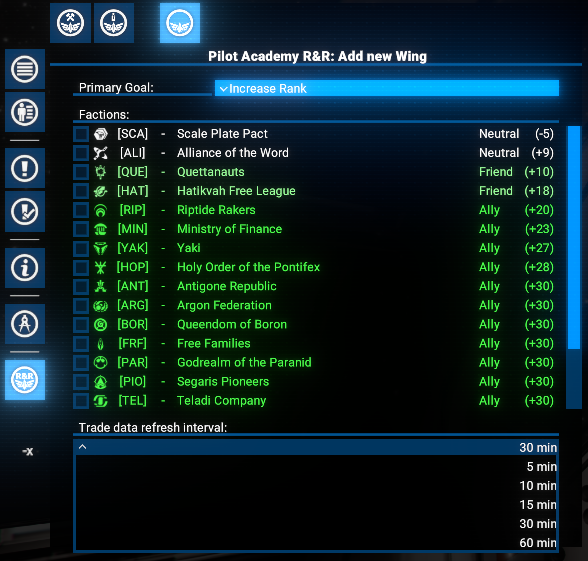
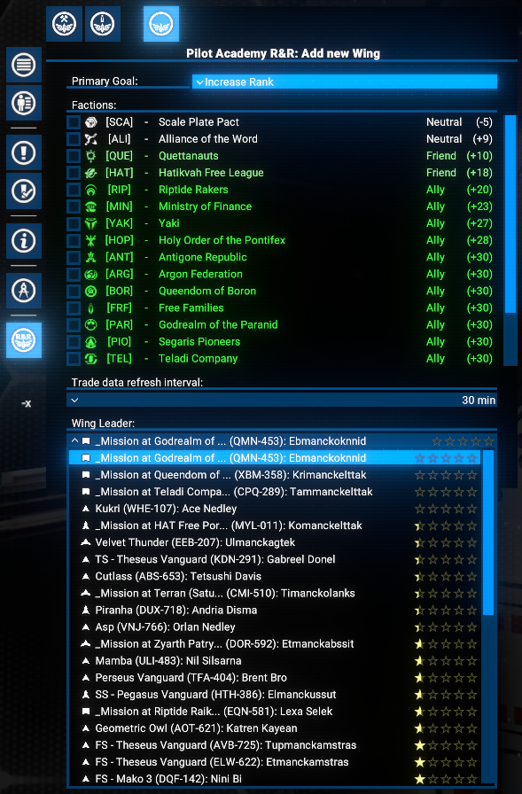

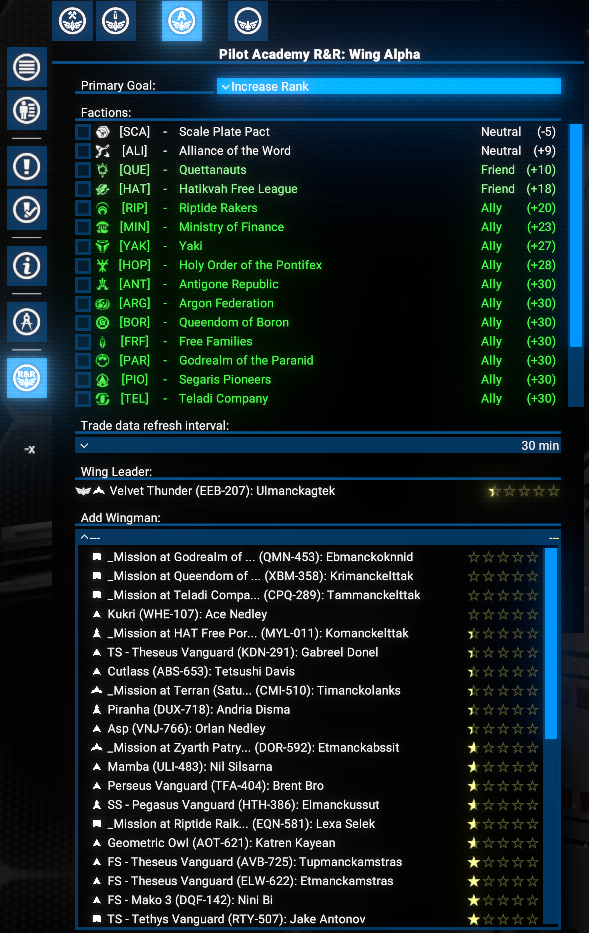
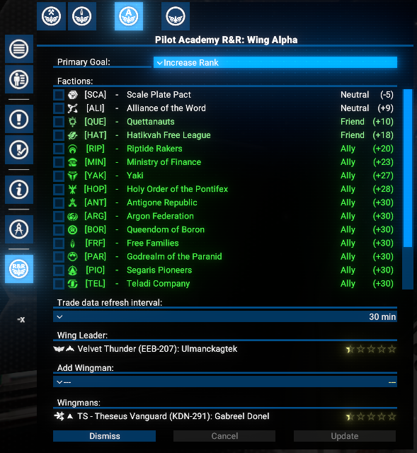
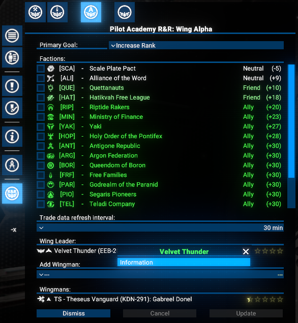
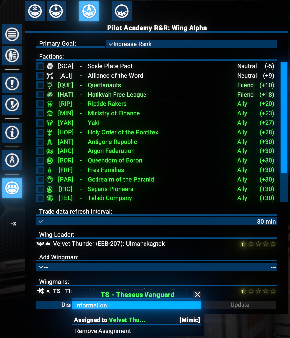

### Research

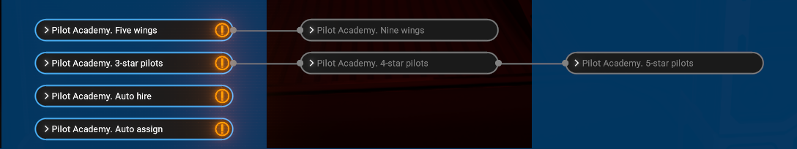

### Options

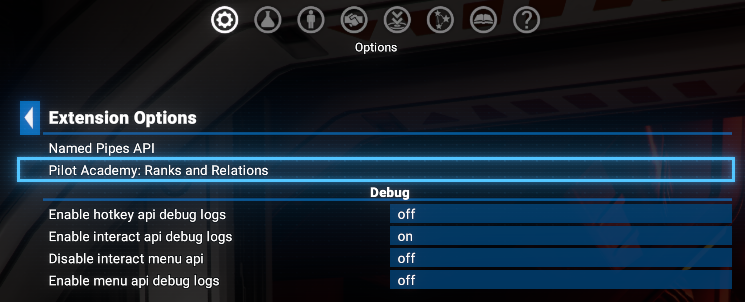
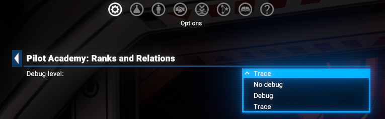

### Notifications

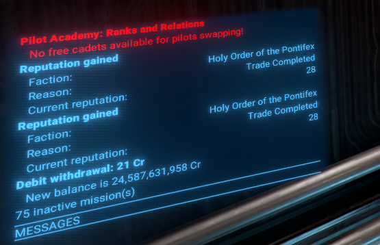
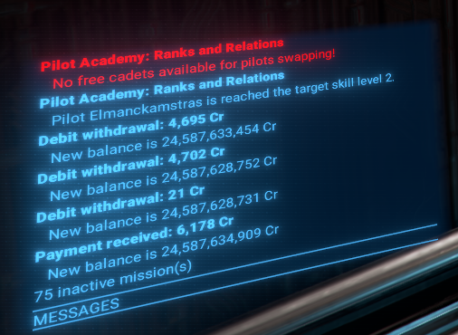
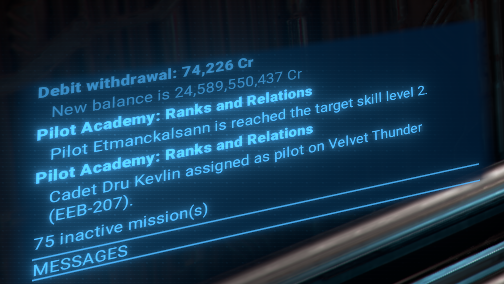
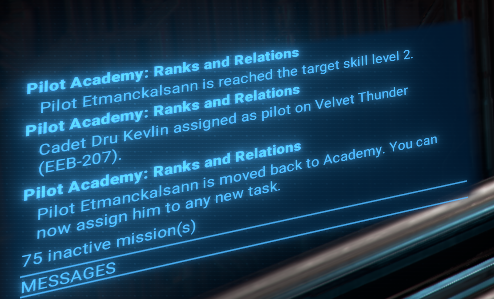

## Video

[Video demonstration of the mod (Version 1.00)](https://www.youtube.com/watch?v=)

## Credits

- **Author**: Chem O`Dun, on [Nexus Mods](https://next.nexusmods.com/profile/ChemODun/mods?gameId=2659) and [Steam Workshop](https://steamcommunity.com/id/chemodun/myworkshopfiles/?appid=392160)
- *"X4: Foundations"* is a trademark of [Egosoft](https://www.egosoft.com).

## Acknowledgements

- [EGOSOFT](https://www.egosoft.com) — for the X series.
- [kuertee](https://next.nexusmods.com/profile/kuertee?gameId=2659) — for the `UI Extensions and HUD` that makes this extension possible.
- [SirNukes](https://next.nexusmods.com/profile/sirnukes?gameId=2659) — for the `Mod Support APIs` that power the UI hooks.

## Changelog

### [1.00] - 2024-02-04

- **Added**
  - Initial public version
